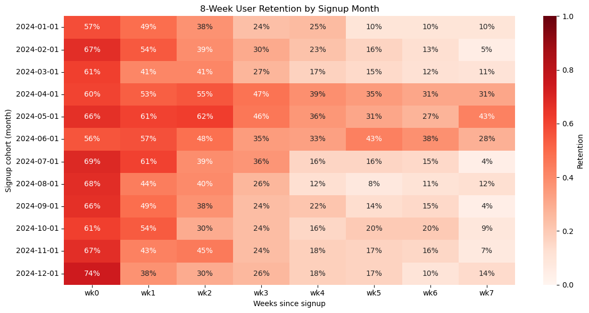
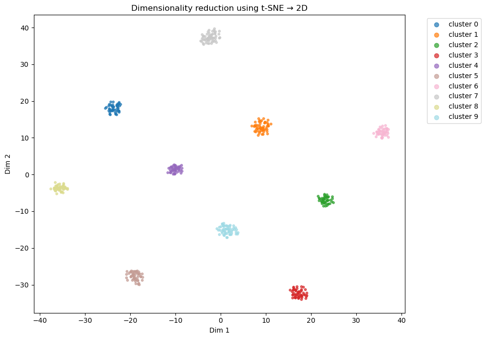
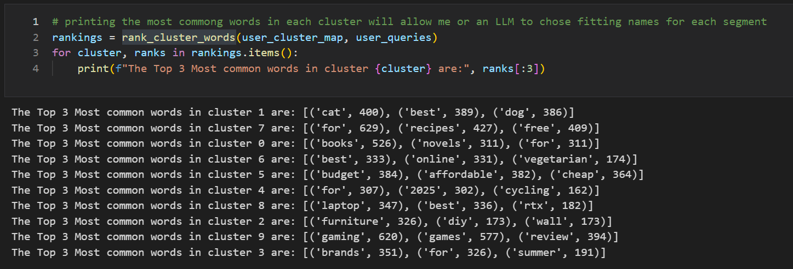

# Strategy Document

Below is a concise summary of the approaches used for each part of the challenge, based on the provided details.

---

## 1. Database Schema

```sql
users(user_id, signup_date, country)
events(user_id, event_type [viewed, add-to-cart, purchased], product_id, timestamp)
products(product_id, category, price)
```

---

## 2. Weekly Active Users Query

* **Approach**: Use a subquery to convert each event’s `timestamp` into a week identifier (e.g., epoch/604800) before grouping.
* **Index**: Added an index on `events(timestamp)` to speed up the bucketing step.

---

## 3. Revenue per Category Query

* **Baseline**: Summing `price * quantity` for all purchased products while grouping by `category` can be costly.
* **Optimized Strategy**:

  1. Count purchased events per `product_id` to get `quantity` for each product.
  2. Join that result with `products` to retrieve `price` and `category`.
  3. Multiply `quantity * price` and sum by `category`, operating on fewer, distinct rows.
  4. Add a partial index on `events` (where `event_type = 'purchased'`) to retrieve only purchase rows.
  5. (Situational) A materialized view can be used for very large-volume, frequently queried data—tradeoff is refresh overhead.

---

## 4. Retention Matrix Insight

> * Whats important to see in this matrix is that even though we see that the number of new signups has increased every fist week of the month that doesnt translate to their retention, and we can see the best months for user retention were from April 2024 to June 2024, so we need to analyze what changes happened in April 2024, and what happened on June most importantly to identify the problem, it would seem that user retention is corolated with work season and holiday season, or maybe with actual temperature seasons. its also interesting how retention up to the first 4 weeks of each month has stayed relatively the same




---

## 5. Behavioral Segmentation



* **Dimension Reduction**: Reduce OpenAI embedding vectors to a lower dimension for efficient clustering.
* **Clustering**: Group users based on the average of all the embeddings of their search queries reduced to a lower dimensional vector.
* **Cluster Naming**: Use `rank_cluster_words()` to extract the most frequent words per cluster, then feed top keywords to an LLM to generate descriptive segment names.



---

